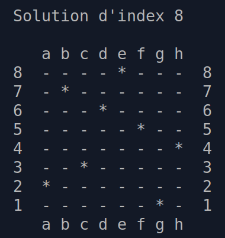

# algorithmes-en-rust

Voilà une recueil d'algorithmes courants, implémentés en langage Rust, pour se faire une idée du langage. Peut éventuellement servir pour préparer des cours.



## Téléchargement / utilisation

Pas de dépendances externes, autres que rust lui_même (voir: https://www.rust-lang.org/fr/tools/install).

```bash
# Alternative à git: $ wget https://github.com/v-espitalier/algorithmes-en-rust/archive/refs/heads/main.zip
git clone https://github.com/v-espitalier/algorithmes-en-rust
cd algorithmes-en-rust
cargo run
```


## Algorithmes d'initiation:

* factorielle (récursive)
https://fr.wikipedia.org/wiki/Factorielle

* fibonacci (itératif et récursif)
https://fr.wikipedia.org/wiki/Suite_de_Fibonacci

* recherche lineaire
https://fr.wikipedia.org/wiki/Recherche_s%C3%A9quentielle

* recherche dichotomique (récursif)
https://fr.wikipedia.org/wiki/Recherche_dichotomique

* pgcd (récursif en Rust et itératif en assembleur)
https://fr.wikipedia.org/wiki/Plus_grand_commun_diviseur

## Algorithmes de tri:

* tri par insertion
https://fr.wikipedia.org/wiki/Tri_par_insertion

* tri par selection
https://fr.wikipedia.org/wiki/Tri_par_s%C3%A9lection

* tri rapide
https://fr.wikipedia.org/wiki/Tri_rapide

* tri fusion
https://fr.wikipedia.org/wiki/Tri_fusion

* tri par tas
https://fr.wikipedia.org/wiki/Tri_par_tas

(Deux implémentations sont parfois proposées, dont la variante est générique et utilise les traits de Rust, afin de pouvoir comparer les différents codes et de disposer d'une implémentation plus simple qui trie uniquement les entiers.)

## Algorithmes associés aux probabilités ou partiellement aléatoires

* Générateur aléatoire MINSTD alias 'minimum standard' (de Park et Miller, 1988)

https://fr.wikipedia.org/wiki/G%C3%A9n%C3%A9rateur_congruentiel_lin%C3%A9aire

https://en.wikipedia.org/wiki/Lehmer_random_number_generator

* Permutation aléatoire de Fisher Yates
https://en.wikipedia.org/wiki/Fisher%E2%80%93Yates_shuffle

* Méthode de Box-Muller, pour générer des lois normales
https://fr.wikipedia.org/wiki/M%C3%A9thode_de_Box-Muller

* Calcul de moyenne et variance de tableaux avec les traits de Rust

## Algorithmes divers

* Résolution du problème des 8 dames
https://fr.wikipedia.org/wiki/Probl%C3%A8me_des_huit_dames

* Recherche de nombres premiers via l'algorithme par essais de division (avec option multithreading)
https://fr.wikipedia.org/wiki/Nombre_premier#Crible_d'%C3%89ratosth%C3%A8ne_et_algorithme_par_essais_de_division

## Fonctionnalités du langage Rust testées:

* Fonctions génériques basées sur les traits: Voir [tri_variances.rs](https://github.com/v-espitalier/algorithmes-en-rust/blob/main/src/tri_variantes.rs)

* Création d'un nouveau type de données (rationnels), et implémentation des traits pour l'addition et la soustraction: Voir [rationnels.rs](https://github.com/v-espitalier/algorithmes-en-rust/blob/main/src/rationnels.rs)

* Multithreading: Cf recherche_premiers_multithreading() dans [divers.rs](https://github.com/v-espitalier/algorithmes-en-rust/blob/main/src/divers.rs#L421)

* Macro unit tests, alias tests de régression: Voir [tests.rs](https://github.com/v-espitalier/algorithmes-en-rust/blob/main/src/tests.rs)

* Code en assembleur inséré dans du Rust: Cf pgcd_asm() dans [divers.rs](https://github.com/v-espitalier/algorithmes-en-rust/blob/main/src/divers.rs#L349)

# Licence
Le code source de ce dépôt est publié sous license MIT.
Voir [LICENSE](https://github.com/v-espitalier/algorithmes-en-rust/blob/main/LICENSE) pour plus d'informations.
